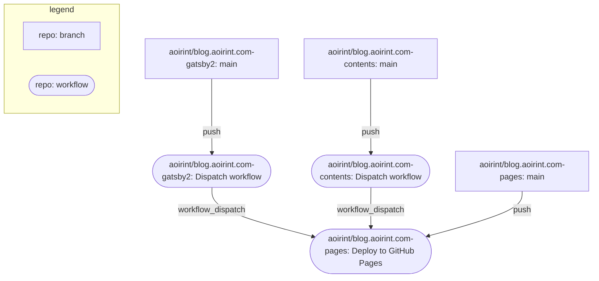

# blog.aoirint.com

- <https://blog.aoirint.com>

Repository to deploy blog.aoirint.com.

## Deploy workflow

```mermaid
flowchart TB
    subgraph legend
        branch[repo: branch]
        workflow([repo: workflow])
    end
    gatsby[aoirint/blog.aoirint.com-gatsby2: main]--push-->gatsby-dispatch
    gatsby-dispatch([aoirint/blog.aoirint.com-gatsby2: Dispatch workflow])--workflow_dispatch-->deploy([aoirint/blog.aoirint.com-pages: Deploy to GitHub Pages])
    contents[aoirint/blog.aoirint.com-contents: main]--push-->contents-dispatch
    contents-dispatch([aoirint/blog.aoirint.com-contents: Dispatch workflow])--workflow_dispatch-->deploy
    this[aoirint/blog.aoirint.com-pages: main]--push-->deploy
```
