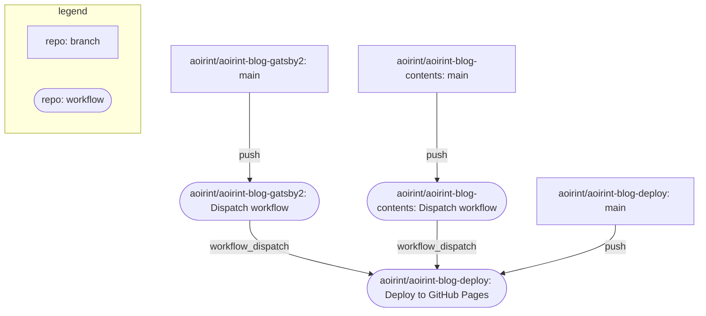

# aoirint-blog-deploy

- <https://blog.aoirint.com>

Repository to deploy blog.aoirint.com.

## Deploy workflow

- Deploy: <https://github.com/aoirint/aoirint-blog-deploy>
- Gatsby: <https://github.com/aoirint/aoirint-blog-gatsby2>
- Contents: <https://github.com/aoirint/aoirint-blog-contents>
