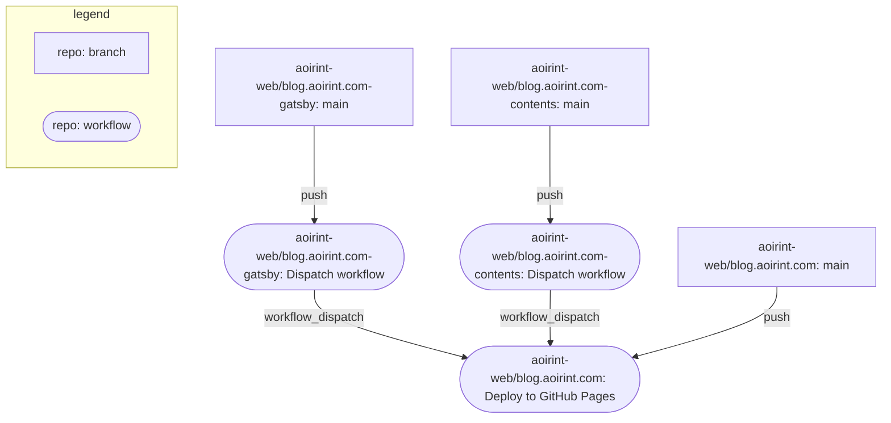

# blog.aoirint.com

- <https://blog.aoirint.com>

Repository to deploy blog.aoirint.com.

## Deploy workflow

```mermaid
flowchart TD
    subgraph legend
        branch[repo: branch]
        workflow([repo: workflow])
    end
    gatsby[aoirint-web/blog.aoirint.com-gatsby: main]--push-->gatsby-dispatch
    gatsby-dispatch([aoirint-web/blog.aoirint.com-gatsby: Dispatch workflow])--workflow_dispatch-->deploy([aoirint-web/blog.aoirint.com: Deploy to GitHub Pages])
    contents[aoirint-web/blog.aoirint.com-contents: main]--push-->contents-dispatch
    contents-dispatch([aoirint-web/blog.aoirint.com-contents: Dispatch workflow])--workflow_dispatch-->deploy
    this[aoirint-web/blog.aoirint.com: main]--push-->deploy
```
